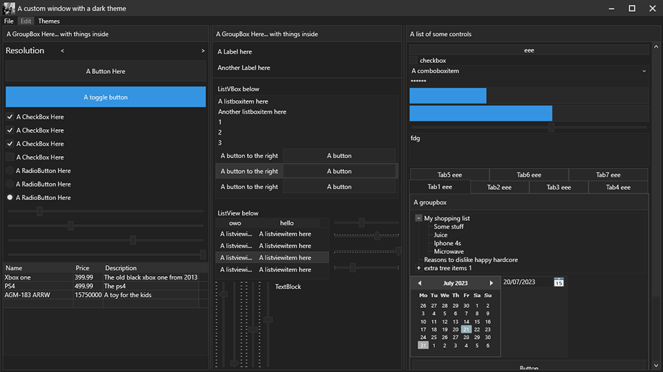

<h2 align="center">Nox Theme Avalonia</h2>

<p align="center">
    <a href="https://www.nuget.org/packages/Nox.Avalonia"></a>
    
    
    
</p>

<p align="center">
    A comprehensive, sleek, and modern theme for <b>Avalonia UI</b> applications!
    <br />
    Designed specifically for <b>Game Engines</b>, <b>Level & Asset Editors</b>, <b>IDEs</b>, and <b>Developer Tools</b>.
</p>

<p align="center">
    
</p>

### Packages Overview

| Package Name                | Description                                        | Target Framework |
| --------------------------- | -------------------------------------------------- | ---------------- |
| `Nox.Avalonia`              | Core theme engine & standard controls              | `net10.0`        |
| `Nox.Avalonia.Dock`         | Theme extension for `Dock.Avalonia`                | `net10.0`        |
| `Nox.Avalonia.DataGrid`     | Theme extension for `Avalonia.Controls.DataGrid`   | `net10.0`        |
| `Nox.Avalonia.PropertyGrid` | Theme extension for `bodong.Avalonia.PropertyGrid` | `net10.0`        |

### Getting Started

Install the latest Nox.Avalonia Package from [Nuget](https://www.nuget.org/packages/Nox.Avalonia)

```bash
dotnet add package Nox.Avalonia
```

#### Basic Usage (Core Theme)

##### Register NoxTheme in your App.axaml

```xml
<Application
    x:Class="Example.App"
    xmlns="https://github.com/avaloniaui"
    xmlns:x="http://schemas.microsoft.com/winfx/2006/xaml"
    xmlns:nox="clr-namespace:Nox.Avalonia;assembly=Nox.Avalonia"
    RequestedThemeVariant="Dark">
    <Application.Styles>
        <nox:NoxTheme />
    </Application.Styles>
</Application>
```

---

#### Optional Theme Packages

Nox includes modular theme packages for popular Avalonia control extensions:

##### 1. Docking Theme (`Nox.Avalonia.Dock`)

```bash
dotnet add package Nox.Avalonia.Dock
```

Add `<dock:DockNoxTheme />` to `App.axaml`:

```xml
<Application ...
    xmlns:dock="clr-namespace:Nox.Avalonia.Dock;assembly=Nox.Avalonia.Dock">
    <Application.Styles>
        <nox:NoxTheme />
        <dock:DockNoxTheme />
    </Application.Styles>
</Application>
```

##### 2. DataGrid Theme (`Nox.Avalonia.DataGrid`)

```bash
dotnet add package Nox.Avalonia.DataGrid
```

Add `<dg:NoxDataGridTheme />` to `App.axaml`:

```xml
<Application ...
    xmlns:dg="clr-namespace:Nox.Avalonia.DataGrid;assembly=Nox.Avalonia.DataGrid">
    <Application.Styles>
        <nox:NoxTheme />
        <dg:NoxDataGridTheme />
    </Application.Styles>
</Application>
```

##### 3. PropertyGrid Theme (`Nox.Avalonia.PropertyGrid`)

```bash
dotnet add package Nox.Avalonia.PropertyGrid
```

Add `<pg:NoxPropertyGridTheme />` to `App.axaml`:

```xml
<Application ...
    xmlns:pg="clr-namespace:Nox.Avalonia.PropertyGrid;assembly=Nox.Avalonia.PropertyGrid">
    <Application.Styles>
        <nox:NoxTheme />
        <pg:NoxPropertyGridTheme />
    </Application.Styles>
</Application>
```

### Contributors

- **[Ricardo Dalarme](https://github.com/ricardodalarme)** ([@ricardodalarme](https://github.com/ricardodalarme)) - Creator and maintainer of Nox Avalonia
- **[AngryCarrot789](https://github.com/AngryCarrot789)** ([@AngryCarrot789](https://github.com/AngryCarrot789)) - Original creator of the base WPF dark theme repository

This project exists thanks to all the people who contribute.

<a href="https://github.com/ricardodalarme/Nox.Avalonia/graphs/contributors">
  
</a>

Want to say thanks? 🙏🏻

- Hit the ⭐ **Star** ⭐ button on GitHub!
